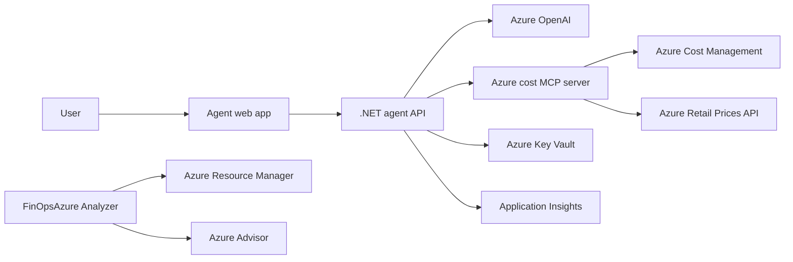

<!--
---
page_type: sample
languages:
- azdeveloper
- bicep
- csharp
- typescript
- python
products:
- azure
- azure-openai
- azure-app-service
- azure-key-vault
- azure-monitor
urlFragment: azure-finops-agent
name: Azure FinOps Agent
description: Analyze Azure cost, inventory, Advisor recommendations, and FinOps optimization opportunities with a keyless, audit-safe AI agent.
---
-->

# Azure FinOps Agent

[](https://codespaces.new/Azure-Samples/azure-finops-agent)
[](https://vscode.dev/redirect?url=vscode://ms-vscode-remote.remote-containers/cloneInVolume?url=https://github.com/Azure-Samples/azure-finops-agent)

Azure FinOps Agent is a sample for building a secure FinOps assistant on Azure. It combines a .NET agent experience, an MCP server for Azure cost intelligence, and a FastAPI/React analyzer for cost, inventory, Advisor recommendations, and optimization opportunities.

The sample is designed for regulated environments: Azure services use managed identity and RBAC, Azure OpenAI local key authentication is disabled, audit-safe read-only mode is enabled by default, and private networking can be enabled through the Bicep parameters.

## Important Security Notice

This template, the application code and configuration it contains, has been built to
showcase Microsoft Azure specific services and tools. We strongly advise our customers
not to make this code part of their production environments without implementing or
enabling additional security features.

## Features

- AI-assisted FinOps analysis over Azure cost, inventory, budgets, forecasts, and Advisor data.
- MCP server (`cost-mcp/`) for Azure Retail Prices, Cost Management, reservations, forecasts, and budgets.
- .NET agent application (`agent/`) with a Vue-based user experience and Azure OpenAI integration.
- FastAPI/React analyzer (`finopsazure-analyzer/`) for cost runs, recommendations, and executive summaries.
- Bicep infrastructure (`infra/`) compatible with Azure Developer CLI (`azd`).
- Keyless authentication with managed identities and RBAC.
- Optional private endpoints for Azure OpenAI and Key Vault.
- Application Insights and Log Analytics for observability.

### Architecture



| Folder | Component | Stack | Purpose |
| --- | --- | --- | --- |
| [`agent/`](agent/) | Agent experience | .NET 10, Vue 3 | Conversational FinOps orchestration |
| [`cost-mcp/`](cost-mcp/) | Cost intelligence MCP server | TypeScript, Node.js | Cost, pricing, reservation, forecast, and budget tools |
| [`finopsazure-analyzer/`](finopsazure-analyzer/) | Analyzer | Python, FastAPI, React | Cost and inventory analysis dashboard |
| [`infra/`](infra/) | Infrastructure as code | Bicep | Azure App Service, Azure OpenAI, Key Vault, networking, monitoring |
| [`docs/`](docs/) | Guidance | Markdown | Architecture decisions, readiness notes, and runbooks |

## Prerequisites

- [Azure Developer CLI](https://learn.microsoft.com/azure/developer/azure-developer-cli/install-azd) (`azd`) 1.14.0 or later
- [Azure CLI](https://learn.microsoft.com/cli/azure/install-azure-cli)
- [.NET 10 SDK](https://dotnet.microsoft.com/download)
- [Node.js](https://nodejs.org/) 22 or later
- [Python](https://www.python.org/) 3.12 or later
- Docker, if you run the analyzer locally
- An Azure subscription with access to Azure OpenAI

### Cost estimation

This sample deploys Azure OpenAI, App Service, Key Vault, virtual networking, Log Analytics, and Application Insights. Costs vary by region, model deployment capacity, traffic, and log ingestion. Review pricing before deploying:

- [Azure OpenAI pricing](https://azure.microsoft.com/pricing/details/cognitive-services/openai-service/)
- [App Service pricing](https://azure.microsoft.com/pricing/details/app-service/)
- [Azure Monitor pricing](https://azure.microsoft.com/pricing/details/monitor/)
- [Key Vault pricing](https://azure.microsoft.com/pricing/details/key-vault/)

## Getting Started

### GitHub Codespaces

Use the **Open in GitHub Codespaces** badge above. The dev container installs `azd`, Azure CLI, .NET, Node.js, Python, and the recommended VS Code extensions.

### VS Code Dev Containers

Use the **Open in Dev Containers** badge above, or run:

```bash
git clone https://github.com/Azure-Samples/azure-finops-agent
cd azure-finops-agent
code .
```

Then reopen the folder in the dev container.

### Local environment

```bash
git clone https://github.com/Azure-Samples/azure-finops-agent
cd azure-finops-agent

azd auth login
azd env new
azd up
```

To enable the strict private-networking posture before deployment:

```bash
azd env set ENABLE_PRIVATE_NETWORKING true
```

To keep the default audit-safe posture:

```bash
azd env set FINOPS_READONLY true
```

## Deployment

The repository is an `azd` template. The default deployment is driven by [`azure.yaml`](azure.yaml) and [`infra/main.bicep`](infra/main.bicep).

```bash
azd auth login
azd env new
azd up
```

During deployment, `azd` provisions the Azure resources and deploys the `agent` service. The Bicep outputs include `SERVICE_AGENT_URI`, the application URL.

### Clean up

```bash
azd down --purge
```

## Guidance

### Region availability

Azure OpenAI model and quota availability varies by region. If deployment fails because the selected model is not available, set:

```bash
azd env set AZURE_OPENAI_LOCATION <region>
azd env set AZURE_OPENAI_MODEL_NAME <model>
azd env set AZURE_OPENAI_MODEL_VERSION <version>
azd env set AZURE_OPENAI_DEPLOYMENT_NAME <deployment-name>
```

### Security guidelines

This template uses [managed identity](https://learn.microsoft.com/entra/identity/managed-identities-azure-resources/overview) and RBAC for Azure OpenAI and Key Vault access. Azure OpenAI local authentication is disabled. The application is read-only by default through `FINOPS_READONLY=true`.

To ensure continued best practices in your own repository, enable [GitHub secret scanning](https://docs.github.com/code-security/secret-scanning/about-secret-scanning), Dependabot alerts, and Microsoft Defender for Cloud.

For regulated deployments, set `ENABLE_PRIVATE_NETWORKING=true` and provide private network connectivity to the deployed application.

### Responsible AI

This sample demonstrates AI-assisted analysis and does not replace human review. Validate generated recommendations before applying any change to a production Azure environment. Review the [Responsible AI Standard](https://www.microsoft.com/ai/responsible-ai) and Azure OpenAI safety guidance before adapting this sample for production.

## Resources

- [Azure Developer CLI documentation](https://learn.microsoft.com/azure/developer/azure-developer-cli/)
- [Make your project compatible with azd](https://learn.microsoft.com/azure/developer/azure-developer-cli/make-azd-compatible)
- [Azure OpenAI documentation](https://learn.microsoft.com/azure/ai-services/openai/)
- [Azure Cost Management documentation](https://learn.microsoft.com/azure/cost-management-billing/cost-management-billing-overview)
- [Azure Well-Architected Framework: Cost Optimization](https://learn.microsoft.com/azure/well-architected/cost-optimization/)
- [Azure FinOps guidance](https://learn.microsoft.com/cloud-computing/finops/)
- [Azure-Samples readiness notes](docs/AZURE-SAMPLES-READINESS.md)

## Contributing

This project welcomes contributions and suggestions. See [CONTRIBUTING.md](CONTRIBUTING.md) for the contribution process and the Microsoft CLA requirements.

## Trademarks

This project may contain trademarks or logos for projects, products, or services.
Authorized use of Microsoft trademarks or logos is subject to and must follow
[Microsoft's Trademark & Brand Guidelines](https://www.microsoft.com/en-us/legal/intellectualproperty/trademarks/usage/general).
Use of Microsoft trademarks or logos in modified versions of this project must not
cause confusion or imply Microsoft sponsorship.
Any use of third-party trademarks or logos are subject to those third-party's policies.
